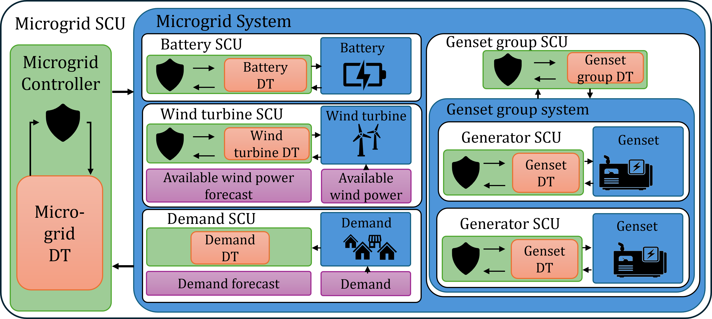

## Context

This code supports paper *Shielded Controller Units for RL with Industrial Constraints Applied to Remote Microgrids* submitted at AAAI 2026 Special Track on AI for Social Impact. It contains the code to reproduce its results by training and evaluating an RL agent on an realistic industrial environment while garanteeing industrial constraint.



## Content

`main.py` contains the code to train the agent using the stable_baselines3 RL library. You will need to be connected to WandB for it to run, or use the CLI argument `disable_wandb`.

`configs/config.yaml` contains the default configuration parameters for the agent, training process, and environment. These can be changed in `main.py` by changing them in the CLI. For example:
```bash
python main.py --config configs/config.yaml --save_dir logs/ --disable_wandb
```

**Modifying Configuration Parameters from CLI:**

You can override any configuration parameter using dot notation. The format is `--key=value` or `--key value`:

```bash
# Modify agent parameters
python main.py --agent.algorithm=PPO --agent.learning_rate=0.001

# Modify environment parameters  
python main.py --environment.microgrid.device.init_params.battery.device.init_params.soc.value=0.5

# Modify training parameters
python main.py --runner.total_timesteps=1000000 --runner.batch_size=64

# Modify reward coefficients
python main.py --environment.reward.fuel_consumption_coeff=2 --environment.reward.battery_degradation_coeff=0.5

# Combine multiple modifications
python main.py --agent.algorithm=SAC --runner.total_timesteps=200000 --environment.microgrid.controller.const_params.conservativeness_coeff=1.5
```

**Key Configuration Sections:**
- `agent.*`: RL algorithm and policy settings
- `runner.*`: Training parameters (timesteps, evaluation frequency)
- `environment.microgrid.*`: Microgrid device configurations and constraints
- `environment.reward.*`: Reward function coefficients

`env/env_microgrid.py` is the environment class simulating a microgrid, . In the environment, the shielded controller unit approach (described in the paper) has been used to garantee the respect of all operational constraints, including the generation/load balance, at every time step. The data used for demand and available wind power is real world data, normalized, accessible in `data/`. The environment can be tested/discovered with notebook `env/test_env.ipynb`.

In `agents/`, baseline heuristic policies have been implemented for performance comparison. They can be tested using `test_baselines.ipynb`. The repo also hosts the definition of RL agents. 

`deploy.py`, `evaluate.py` and `plot_trajectory.py` serve different evaluation purposes:

- **`deploy.py`**: Deploys trained models or baseline agents in the microgrid environment, records episode statistics, and can run multiple evaluation iterations. Supports both RL agents and heuristic baselines.

- **`evaluate.py`**: Simple evaluation script that runs a trained model or baseline agent for a fixed number of episodes and reports mean/std rewards. Lightweight for quick performance assessment.

- **`plot_trajectory.py`**: Comprehensive trajectory analysis and visualization tool. Generates detailed plots of microgrid operations, supports multiple baseline agents, and can render the environment with Pygame for visual inspection.


## Install instructions

You can install the requirements with:
`pip install -r ./requirements.txt`

**Note**: Verify that all dependencies are compatible with your Python environment.
    

## Data Download

The environment requires real-world data for demand and available wind power, which is available in the [chandar-lab/remote_microgrid_data](https://huggingface.co/datasets/chandar-lab/remote_microgrid_data/tree/main) dataset on Hugging Face.

To download the data files:

1. **Create a data directory:**
   ```bash
   mkdir -p data/
   ```

2. **Download the data files:**

   ```bash
   pip install huggingface_hub
   huggingface-cli download chandar-lab/remote_microgrid_data --local-dir ./data/
   ```


The data files contain normalized real-world demand and wind-power microgrid data.


## Citation

```bibtex
@article{nekoei2025shielded,
  title   = {Shielded Controller Units for RL with Operational Constraints Applied to Remote Microgrids},
  author  = {Nekoei, Hadi and Blondin Massé, Alexandre and Hassani, Rachid and Chandar, Sarath and Mai, Vincent},
  journal = {arXiv preprint arXiv:2512.01046},
  year    = {2025}
}
```

## 📄 License

This repository uses a dual licensing model:

- The **source code** is licensed under the MIT License.
- The **data files** in the `data/` directory are licensed under the Creative Commons Attribution-NonCommercial 4.0 International License.

